# Keycloak OIDC Demo

Demo del flusso **Authorization Code Flow** (OAuth 2.0 + OpenID Connect) con Keycloak e PHP.

---

## Flusso di autenticazione — OIDC Authorization Code Flow

**Protocollo:** OpenID Connect 1.0 sopra OAuth 2.0 Authorization Code Flow — il flusso più sicuro per applicazioni web con backend.

| Aspetto | Dettaglio |
|---|---|
| **Protocollo base** | OAuth 2.0 Authorization Code Flow |
| **Strato identità** | OpenID Connect — scope `openid` + `id_token` |
| **Algoritmo firma JWT** | RS256 (asimmetrico, chiave pubblica via JWKS) |
| **CSRF protection** | Parametro `state` random, verificato in `callback.php` |
| **Client authentication** | `client_secret` (Confidential Client — il secret non esce mai dal browser) |
| **Token exchange** | Server-to-server via Docker network interno (`keycloak:8080`) |
| **JWKS caching** | Cache locale filesystem TTL 1 ora |
| **Refresh proattivo** | 30 secondi prima della scadenza (`exp - 30`) |
| **Logout** | OIDC RP-Initiated Logout con `id_token_hint` |

```mermaid
sequenceDiagram
    autonumber
    actor Browser
    participant App as PHP App<br/>(localhost:8081)
    participant KC as Keycloak<br/>(localhost:8080 / keycloak:8080)
    participant Cache as JWKS Cache<br/>(filesystem /tmp)

    Note over Browser,KC: ── PROTOCOLLO: OpenID Connect (OIDC) su OAuth 2.0 Authorization Code Flow ──

    rect rgb(230, 240, 255)
        Note over Browser,KC: FASE 1 — Avvio login (login.php)
        Browser->>App: GET /dashboard.php (pagina protetta)
        App->>App: requireAuth() → sessione vuota
        App-->>Browser: 302 Redirect → /login.php

        Browser->>App: GET /login.php
        App->>App: genera state = random_bytes(16)<br/>salva $_SESSION['oauth_state']
        App-->>Browser: 302 Redirect → Keycloak /auth<br/>?client_id=local-client-1<br/>&redirect_uri=http://localhost:8081/callback.php<br/>&response_type=code<br/>&scope=openid profile email roles<br/>&state={state}
    end

    rect rgb(255, 245, 220)
        Note over Browser,KC: FASE 2 — Autenticazione su Keycloak
        Browser->>KC: GET /realms/Fonarcom/protocol/openid-connect/auth?...
        KC-->>Browser: 200 OK — Form di login HTML

        Browser->>KC: POST credenziali (username + password)
        KC->>KC: valida credenziali<br/>genera authorization code (one-time, short-lived)
        KC-->>Browser: 302 Redirect → /callback.php<br/>?code={authorization_code}<br/>&state={state}
    end

    rect rgb(220, 255, 230)
        Note over Browser,KC: FASE 3 — Scambio code → token (callback.php) [server-to-server]
        Browser->>App: GET /callback.php?code={code}&state={state}

        App->>App: verifica state == $_SESSION['oauth_state']<br/>⚠ CSRF protection — mismatch → errore 400

        App->>KC: POST /realms/Fonarcom/protocol/openid-connect/token<br/>(via Docker network: keycloak:8080)<br/>grant_type=authorization_code<br/>code={code}<br/>client_id=local-client-1<br/>client_secret={secret}<br/>redirect_uri=http://localhost:8081/callback.php
        KC->>KC: valida code + client_secret<br/>code è monouso → lo invalida
        KC-->>App: 200 JSON {<br/>  access_token: {JWT},<br/>  refresh_token: {opaque/JWT},<br/>  id_token: {JWT},<br/>  expires_in: 300<br/>}
    end

    rect rgb(255, 225, 225)
        Note over Browser,Cache: FASE 4 — Verifica firma JWT + store sessione
        App->>Cache: getJwks() — cache valida? (TTL 1h)
        alt cache HIT (< 1 ora)
            Cache-->>App: JWKS da file /tmp/jwks_cache.json
        else cache MISS o scaduta
            App->>KC: GET /realms/Fonarcom/protocol/openid-connect/certs<br/>(via Docker network: keycloak:8080)
            KC-->>App: 200 JSON — JWKS (chiavi pubbliche RS256)
            App->>Cache: salva JWKS su /tmp/jwks_cache.json
            Cache-->>App: OK
        end

        App->>App: JWT::decode(access_token, JWKS)<br/>verifica: firma RS256, exp, iss, aud<br/>estrae: preferred_username, name, email,<br/>realm_access.roles, exp

        App->>App: $_SESSION = {<br/>  kc_user: {username, name, email, roles},<br/>  kc_exp: {unix timestamp},<br/>  kc_access_token, kc_refresh_token, kc_id_token<br/>}

        App-->>Browser: 302 Redirect → /dashboard.php
        Browser->>App: GET /dashboard.php
        App->>App: requireAuth() → sessione valida ✓
        App-->>Browser: 200 OK — pagina dashboard
    end

    rect rgb(240, 230, 255)
        Note over Browser,KC: FASE 5 — Refresh automatico (ogni richiesta a pagina protetta)
        Browser->>App: GET /dashboard.php (richiesta successiva)
        App->>App: requireAuth()<br/>time() >= kc_exp - 30 ?<br/>(anticipa refresh di 30s)
        alt token scaduto o in scadenza
            App->>KC: POST /realms/Fonarcom/protocol/openid-connect/token<br/>grant_type=refresh_token<br/>refresh_token={refresh_token}<br/>client_id + client_secret
            alt refresh token valido
                KC-->>App: 200 JSON — nuovi access_token + refresh_token
                App->>App: _storeSession() → aggiorna sessione
                App-->>Browser: 200 OK — pagina servita
            else refresh token scaduto/revocato
                KC-->>App: 400 invalid_grant
                App->>App: session_destroy()
                App-->>Browser: 302 Redirect → /login.php
            end
        else token ancora valido
            App-->>Browser: 200 OK — usa sessione esistente
        end
    end

    rect rgb(240, 240, 240)
        Note over Browser,KC: FASE 6 — Logout (logout.php)
        Browser->>App: GET /logout.php
        App->>App: salva kc_id_token dalla sessione<br/>session_destroy()
        App-->>Browser: 302 Redirect → Keycloak /logout<br/>?id_token_hint={id_token}<br/>&post_logout_redirect_uri=http://localhost:8081/
        Browser->>KC: GET /realms/Fonarcom/protocol/openid-connect/logout?...
        KC->>KC: invalida sessione SSO<br/>verifica id_token_hint
        KC-->>Browser: 302 Redirect → http://localhost:8081/
        Browser->>App: GET /
    end
```



---

## Prerequisiti

- [Docker Desktop](https://www.docker.com/products/docker-desktop/)
- Nessun altro requisito — tutto gira nei container

---

## Avvio rapido

```bash
# 1. Clona / entra nella directory
cd kc_farc

# 2. Avvia tutti i servizi
docker compose up -d --build

# 3. Installa le dipendenze PHP (solo al primo avvio o dopo un rebuild)
docker exec php_demo composer install --no-dev --working-dir=/var/www/html
```

### Servizi avviati

| Servizio | URL | Credenziali |
|---|---|---|
| **Demo PHP** | http://localhost:8081 | — |
| **Keycloak Admin** | http://localhost:8080/admin | `admin` / `admin` |
| **PostgreSQL** | `localhost:5432` | `keycloak` / `keycloak_secret` |

---

## Configurazione iniziale Keycloak (una tantum)

Esegui i comandi seguenti **nell'ordine indicato** dopo `docker compose up -d`:

```bash
# Autenticati come admin
docker exec keycloak /opt/keycloak/bin/kcadm.sh config credentials \
  --server http://localhost:8080 --realm master --user admin --password admin

# Disabilita SSL required su master (sviluppo locale)
docker exec keycloak /opt/keycloak/bin/kcadm.sh update realms/master -s sslRequired=none

# Crea il realm Fonarcom
docker exec keycloak /opt/keycloak/bin/kcadm.sh create realms \
  -s realm=Fonarcom -s enabled=true -s sslRequired=none

# Crea il client local-client-1
docker exec keycloak /opt/keycloak/bin/kcadm.sh create clients -r Fonarcom \
  -s clientId=local-client-1 \
  -s enabled=true \
  -s publicClient=true \
  -s 'redirectUris=["http://localhost:8081/callback.php","http://localhost:8081/*"]' \
  -s 'webOrigins=["http://localhost:8081"]' \
  -s 'attributes={"post.logout.redirect.uris":"http://localhost:8081/##http://localhost:8081/*"}'

# Crea un utente di test
docker exec keycloak /opt/keycloak/bin/kcadm.sh create users -r Fonarcom \
  -s username=testuser \
  -s enabled=true \
  -s email=test@fonarcom.it \
  -s firstName=Test \
  -s lastName=User

# Imposta la password (non temporanea)
docker exec keycloak /opt/keycloak/bin/kcadm.sh set-password -r Fonarcom \
  --username testuser --new-password password
```

---

## Service account per la Admin REST API

Per chiamare la KC Admin REST API da server (es. user provisioning) serve un client con **Service Accounts** abilitato. Il service account ottiene un access token via `client_credentials` grant — nessun utente coinvolto.

### Creazione con `kcadm.sh`

```bash
# 1. Crea il client con service accounts abilitati
docker exec keycloak /opt/keycloak/bin/kcadm.sh create clients -r Fonarcom \
  -s clientId=farc-admin-sa \
  -s enabled=true \
  -s publicClient=false \
  -s serviceAccountsEnabled=true \
  -s clientAuthenticatorType=client-secret

# 2. Recupera l'UUID interno del client appena creato
docker exec keycloak /opt/keycloak/bin/kcadm.sh get clients -r Fonarcom \
  -q clientId=farc-admin-sa --fields id,clientId

# 3. Leggi il secret generato automaticamente (sostituisci {CLIENT_UUID} con il valore del passo 2)
docker exec keycloak /opt/keycloak/bin/kcadm.sh get \
  clients/{CLIENT_UUID}/client-secret -r Fonarcom

# 4. Assegna il ruolo manage-users al service account
#    (il nome utente del SA è sempre service-account-{clientId})
docker exec keycloak /opt/keycloak/bin/kcadm.sh add-roles -r Fonarcom \
  --uusername service-account-farc-admin-sa \
  --cclientid realm-management \
  --rolename manage-users
```

### Valori da copiare nella configurazione

| Costante | Valore |
|---|---|
| `KC_ADMIN_CLIENT_ID` | `farc-admin-sa` (il clientId scelto sopra) |
| `KC_ADMIN_CLIENT_SECRET` | Il valore restituito dal passo 3 (`"value": "..."`) |

### Verifica

```bash
# Ottieni un token e verifica che risponda con un JWT
curl -s -X POST http://localhost:8080/realms/Fonarcom/protocol/openid-connect/token \
  -d "grant_type=client_credentials" \
  -d "client_id=farc-admin-sa" \
  -d "client_secret=IL_TUO_SECRET" \
  | python3 -m json.tool | grep access_token
```

### Perché un client separato

Il client OIDC (`local-client-1`) è **public** (nessun secret) — è pensato per i redirect browser dell'utente finale. Il service account richiede un client **confidential** (con secret) e non interagisce mai con il browser. Tenerli separati limita i permessi: il client OIDC non ha accesso all'Admin API.

---

## Struttura del progetto

```
kc_farc/
├── docker-compose.yml       # PostgreSQL + Keycloak + PHP/Apache
├── Dockerfile               # PHP 8.2 + Apache + Xdebug + Composer
├── xdebug.ini               # Configurazione Xdebug
├── .vscode/
│   └── launch.json          # Debug PHP in VS Code (F5)
└── app/
    ├── config.php            # Costanti: realm, client, URL Keycloak
    ├── jwks_cache.php        # Fetch + cache (1h) chiavi pubbliche JWKS
    ├── index.php             # Homepage con pulsante login
    ├── login.php             # Genera state, redirect a Keycloak
    ├── callback.php          # Valida state, scambia code→token, verifica JWT
    ├── dashboard.php         # Mostra dati utente dopo il login
    └── logout.php            # Distrugge sessione + redirect KC end_session
```

---

## Aggiungere nuove pagine protette

Ogni pagina che richiede autenticazione deve iniziare con:

```php
<?php
require_once 'auth.php';
$user = requireAuth();

// Da qui $user è garantito valido:
// $user['username'], $user['name'], $user['email'], $user['roles']
```

`requireAuth()` gestisce automaticamente:

| Situazione | Comportamento |
|---|---|
| Sessione assente | Redirect a `login.php` |
| Access token scaduto (default: 5 min) | Refresh silenzioso con Keycloak |
| Refresh token scaduto (default: 30 min) | Sessione distrutta + redirect a `login.php` |
| Refresh token revocato da KC | Sessione distrutta + redirect a `login.php` |

### Come funziona il refresh

`requireAuth()` viene chiamata in cima a ogni pagina protetta e segue questo flusso:

```
requireAuth() chiamata su ogni pagina protetta
       │
       ▼
 kc_user in sessione? ──No──→ redirect login.php
       │
      Sì
       │
       ▼
 time() >= kc_exp - 30? ──No──→ return $user  (token ancora valido)
       │
      Sì  (scaduto o mancano < 30 sec)
       │
       ▼
 POST /token  grant_type=refresh_token  ← una sola chiamata a KC
       │
  risposta ok? ──No──→ session_destroy() → redirect login.php
       │
      Sì
       │
       ▼
 _storeSession() → nuovi access_token + refresh_token salvati in sessione
       │
       ▼
 return $user
```

**Quante volte viene usato il refresh token?**

Il refresh token viene usato **una volta per ogni scadenza dell'access token**. Ogni volta che viene usato, KC emette una nuova coppia e quello precedente viene invalidato immediatamente (rotazione obbligatoria):

```
login
  → access_token_1 (scade in 5 min) + refresh_token_1 (scade in 30 min)

dopo 5 min → refresh_token_1 usato (1 volta) → invalidato
  → access_token_2 + refresh_token_2

dopo altri 5 min → refresh_token_2 usato (1 volta) → invalidato
  → access_token_3 + refresh_token_3

...

dopo 30 min totali → refresh_token scaduto → KC risponde invalid_grant
  → session_destroy() → redirect login.php  (nuovo login richiesto)
```

> **Attenzione:** se un vecchio refresh token già ruotato viene riutilizzato (es. due tab aperte in race condition), KC lo interpreta come potenziale furto di token e invalida **tutta la sessione SSO**.

Note importanti:
- **Il refresh token viene ruotato**: KC ne emette uno nuovo ad ogni refresh, quello vecchio viene invalidato immediatamente.
- **Se il refresh token è scaduto**: KC risponde `invalid_grant` → l'utente deve rifare il login.
- **Se l'admin revoca la sessione** dalla console KC (o l'utente fa logout da un altro dispositivo): KC risponde `invalid_grant` → stesso comportamento.
- **Il logout da KC non è immediato nell'app**: l'app si accorge della revoca solo al successivo tentativo di refresh (allo scadere dell'access token). Per notifica immediata serve implementare il Back-Channel Logout.

---

## Debug con VS Code

1. Installa l'estensione **PHP Debug** (`xdebug.php-debug`)
2. Premi `F5` → seleziona **PHP Debug (Docker)**
3. Metti un breakpoint in un file PHP in `app/`
4. Apri http://localhost:8081 nel browser

---

## Fermare i servizi

```bash
docker compose down
```

Per cancellare anche il volume del database:

```bash
docker compose down -v
```
